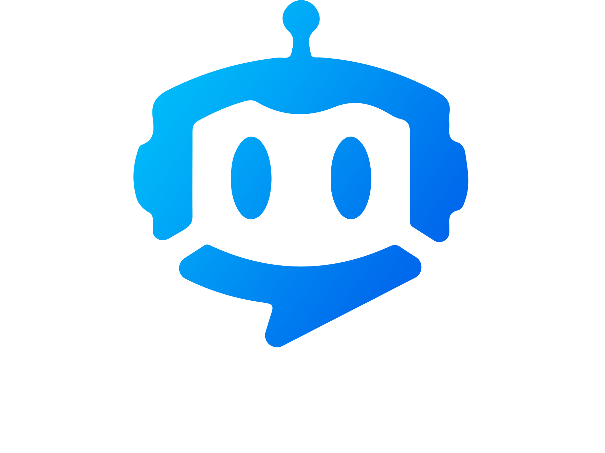

<div align="center">
    
</div>

# IntelliGuide Dashboard 🤖📊

> A web-based management dashboard for IntelliGuide AI-powered event robots

## 📋 Project Overview

IntelliGuide Dashboard is a comprehensive web application developed as part of a first-semester project at **Fontys ICT Eindhoven**. This dashboard serves as the central management interface for IntelliGuide robots - physical AI-powered assistants designed to help event organizers provide intelligent visitor support at events.

The dashboard enables event organizers to:
- 🎯 **Program and configure** AI robots with event-specific context
- 📊 **Monitor robot performance** and interactions in real-time
- 💬 **Review conversations** between visitors and robots
- ⚙️ **Manage robot settings** including appearance, voice, and behavior
- 📈 **Analyze visitor feedback** and robot effectiveness

## 🔗 Related Repositories

This project is part of the larger IntelliGuide ecosystem:

- **[Daanylo/intelliGuide-API](https://github.com/Daanylo/intelliGuide-API)** - Backend API that provides data to the dashboard
- **[Daanylo/intelliBot-Chat](https://github.com/Daanylo/intelliBot-Chat)** - Chat interface for the physical robot interactions

## 🏗️ Project Architecture

### Technology Stack
- **Framework**: ASP.NET Core 8.0 (C#)
- **Frontend**: Razor Pages with Bootstrap 5
- **Database**: Originally MySQL (migrating to SQLite in-memory)
- **Authentication**: Session-based authentication
- **Environment**: .NET 8.0 with environment configuration

### Key Features
- 🎨 **Modern Responsive UI** - Clean, intuitive dashboard interface
- 👥 **User Management** - Multi-user support with session handling
- 🤖 **Robot Configuration** - Comprehensive bot setup and customization
- 📅 **Event Management** - Create and manage events with associated robots
- 💭 **Conversation Monitoring** - Real-time chat history and analytics
- 🆘 **Help Desk Integration** - Support ticket management
- 📊 **Analytics Dashboard** - Performance metrics and insights

## 🚀 Getting Started

### Prerequisites
- .NET 8.0 SDK or later
- Visual Studio 2022 or VS Code
- Git

### Installation

1. **Clone the repository**
   ```bash
   git clone <repository-url>
   cd intelliGuide-Dashboard
   ```

2. **Install dependencies**
   ```bash
   dotnet restore
   ```

3. **Configure environment**
   - Copy `appsettings.Development.json` and update API settings
   - Ensure the IntelliGuide API is running on `http://localhost:3000`
   - Update API key in configuration if needed

4. **Run the application**
   ```bash
   dotnet run
   ```

5. **Access the dashboard**
   - Open your browser and navigate to `http://localhost:5000`
   - Login with valid credentials (provided by the API)

### Configuration

Update the following settings in `appsettings.Development.json`:

```json
{
  "intelliGuide": {
    "ApiAddress": "http://localhost:3000",
    "ApiKey": "your-api-key-here"
  }
}
```

## 📁 Project Structure

```
intelliGuide-Dashboard/
├── Controllers/           # MVC Controllers
│   ├── DashboardController.cs
│   └── LoginController.cs
├── Models/               # Data models
│   ├── Bot.cs
│   ├── User.cs
│   ├── Event.cs
│   ├── Conversation.cs
│   ├── Message.cs
│   ├── Context.cs
│   └── Help.cs
├── Views/                # Razor views
│   ├── Dashboard/        # Dashboard pages
│   ├── Login/            # Authentication
│   └── Shared/           # Layout templates
├── wwwroot/              # Static assets
│   ├── css/              # Stylesheets
│   ├── js/               # JavaScript files
│   └── resources/        # Images and icons
├── Filters/              # Custom filters
└── Properties/           # Project configuration
```

## 🎯 Key Functionality

### Dashboard Pages
- **📊 Status** - Robot status overview and system health
- **🔍 Search** - Search through conversations and data
- **📝 Context** - Manage robot knowledge base and context
- **🎪 Events** - Create and manage events
- **🔔 Notifications** - System alerts and updates
- **⚙️ Settings** - Application and robot configuration

### Robot Management
- Configure robot personality and appearance
- Set event-specific context and knowledge
- Monitor real-time robot interactions
- Review visitor feedback and ratings

### Analytics & Monitoring
- Conversation success rates
- Popular visitor questions
- Robot response effectiveness
- Event performance metrics

## 🔒 Security Features

- **Session Management** - Secure user sessions with timeout
- **Authentication Filter** - Protected routes with session validation
- **API Key Protection** - Secure communication with backend API
- **HTTPS Support** - SSL/TLS encryption in production

## 📱 Responsive Design

The dashboard is fully responsive and optimized for:
- 🖥️ Desktop computers
- 📱 Tablets
- 📲 Mobile devices

## 🛠️ Development

### Running in Development
```bash
# Run with hot reload
dotnet watch run

# Run specific environment
dotnet run --environment Development
```

### Building for Production
```bash
# Build release version
dotnet build --configuration Release

# Publish for deployment
dotnet publish --configuration Release --output ./publish
```

## 📊 Database Schema

The application works with the following main entities:
- **Users** - Event organizers and administrators
- **Events** - Managed events with associated robots
- **Bots** - AI robot configurations and settings
- **Conversations** - Chat sessions between visitors and robots
- **Messages** - Individual chat messages
- **Context** - Robot knowledge base entries
- **Help** - Support requests and tickets

For detailed database structure, see `database-overview.md`.

## 🎓 Educational Context

This project was developed as part of the curriculum at **Fontys ICT Eindhoven** during the first semester. It demonstrates:

- **Full-Stack Development** - Complete web application with MVC architecture
- **API Integration** - Communication with external services
- **User Experience Design** - Intuitive dashboard interface
- **Data Management** - Complex data relationships and CRUD operations
- **Security Implementation** - Authentication and authorization
- **Responsive Design** - Multi-device compatibility

## 🤝 Contributing

This is an educational project. For questions or suggestions:
1. Check the related repositories for the complete system
2. Review the project documentation
3. Ensure the API backend is properly configured

## 📄 License

This project was created for educational purposes at Fontys ICT Eindhoven.

## 🙏 Acknowledgments

- **Fontys ICT Eindhoven** - Educational institution and project framework
- **IntelliGuide Team** - Collaborative development effort
- **Event Industry Partners** - Real-world use case validation

---

*Part of the IntelliGuide ecosystem - Making events smarter with AI-powered assistance* 🚀
